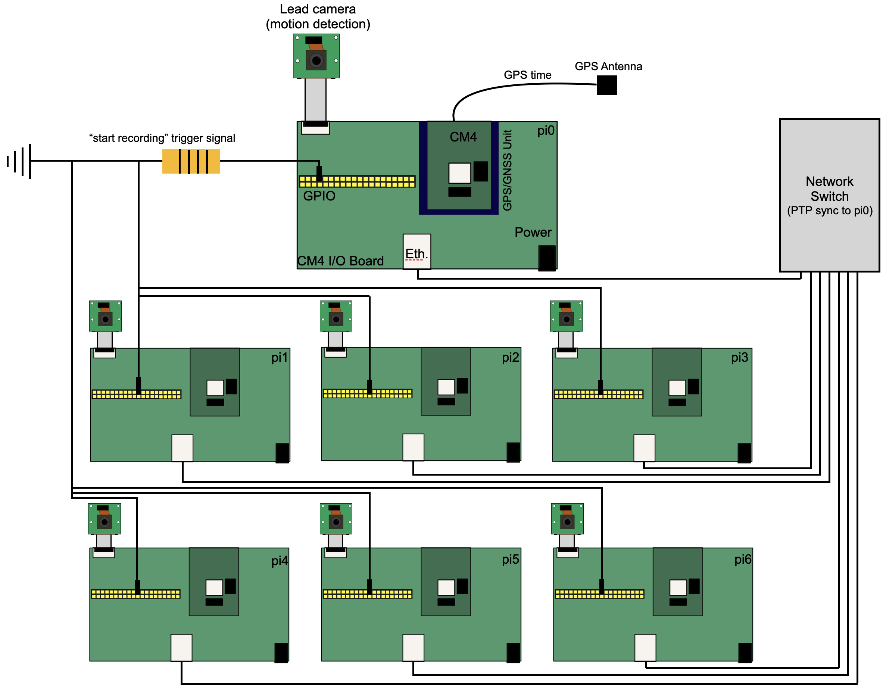

# Code for operating 3D-SOCS


Diagram of hardware setup for 3DSOCS.

## Overview 
Raspi CM4 are networked using a switch. Lead CM4 (pi0 in diagram) uses a GNSS module to acquire lead time. Follower CM4 synchronize their internal clocks with lead CM4. Custom encoder in Picamera script ```record_videos.py``` disciplines framerate to internal clock. Frames consistently achieve <1ms synchronization. Lead CM4 runs ```motion_detector.py``` to detect motion within setup. When motion is detected, a signal is sent using GPIO to all follower CM4, which start recording. Recordings last for a user defined amount of time (we used 60s). Once recordings having been recovered from the CM4, they must then be converted from .h264 to .mp4 format with associated frame-time metadata using ```convert_videos_to_mp4.py```. At this point, you can move to the 3D-tracking pipeline.

## Contents
Directory  | Description
------------- | -------------
admin_shell_scripts | shell scripts to be run on laptop for admin tasks
ptp_configs | configuration files for lead and follower CM4 if using Timebeat for PTP synchronization
rpi_code | python and shell scripts for recording videos, operating stimulus display device.

### Contents of ```admin_scripts```
Filename  | Description
------------- | -------------
convert_videos_to_mp4.py | python script that converts .h264 videos to .mp4 and outputs time metadata for frame matching
pull_data.sh | copies video and metadata from all CM4 using rsync to local directory
ssh_all_pi.sh | opens ssh connections to all CM4

### Contents of ```ptp_configs```
Filename  | Description
------------- | -------------
lead_timebeat.yml | PTP config file for lead CM4
follower_timebeat.yml | PTP config file for follower CM4s

### Contents of ```rpi_code```
Filename  | Description
------------- | -------------
motion_detector.py | script that detects motion and sends 
record_videos.py | script that records frame synchronized videos on follower CM4.
rfid_perch.py | generalizable script to record data from RFID reader.
stimulus_device.py | script that controlled stimulus device used in manuscript.

## Further information

All python code was written for Python3. Packages required for python scripts:
- Picamera2
- libcamera
- cv2 
- RPi.GPIO
- numpy
- vidgear
- pandas

## Misc tips and tricks

### Shell scripts
* ```tmux``` is required to run these shell scripts, and can be installed using apt or similar (https://github.com/tmux/tmux/wiki).
* These scripts require you to input your own usernames, IP addresses, and local directory structures. IP addresses should be those that CM4 assign themselves automatically when no network connection is present, and can be checked with ```ifconfig```.

### PTP
* We highly recommend using timebeat's software for handling PTP. Make sure you obtain a license and move it to the correct directory ```/etc/timebeat/timebeat.lic```.

* PTP could fail if the system time at boot is out of bounds of the time-period defined by the license. To fix this, manually set the system time to within bounds using something like ```sudo date -s 'yyyy-mm-dd hh:mm:ss'``` and reboot.

* be sure to copy config .ymls to ```/etc/timebeat/timebeat.yml```

* To monitor the time synchronization remotely using Timebeat's software, be sure to input the IP of your connected machine into the .yml files in ```ptp_configs``` and uncomment the line:

```shell
# ---------------------------- Elasticsearch Output ----------------------------
output.elasticsearch:
  #enabled: false
  # Array of hosts to connect to.
  # hosts: ['YourIPGoesHere'] # insert ip address of your elastic server
```

* NTP (and other time sync programs) interfere with PTP. Make sure they're disabled using:

```shell
timedatectl | grep NTP
sudo timedatectl set-ntp false
```

* Use minicom to monitor the satellite connection, instructions here: https://support.timebeat.app/hc/en-gb/articles/13208081167378-Timebeat-Timecard-Mini-Troubleshooting-Guide

## Supplementary Information

### Setting up 3D-SOCS
In the following sections we give critical instructions and details for successfully deploying 3D-SOCS. Running the system requires some proficiency in Linux and Python programming, and computer hardware and networking. An overview of the hardware setup is illustrated above. pi0 is the lead CM4, and is responsible for acquiring the lead time from GPS satellites and signalling all other follower CM4s to start and stop recording. A list of required hardware and prices as of 2024 is provided in our github repository.


### Raspberry Pi Compute Module
Each camera is controlled by a Raspberry Pi Compute Module 4 (CM4) running the Raspberry Pi OS Linux distribution (https://www.raspberrypi.com/software/). These micro-computers are manufactured without any traditional I/O. Thus each CM4 must first be connected to an I/O board in order to be used https://www.raspberrypi.com/products/compute-module-4-io-board/, which take a barrel-jack 12v power supply. Furthermore, CM4 come in a variety of options, depending on the amount of RAM required and the type of storage---eMMC (embedded NAND flash memory) versus lite (external microSD card). For our setup, we used a mixture of 2, 4 and 8GB RAM eMMC variants due to supply availability issues, but we suggest using the 8 GB RAM lite option. The lite option allows you to easily flash the operating system onto micro-SD cards using Raspberry Pi Imager (or equivalent) software. We recommend using 64GB SD cards so that onboard storage of videos is never a problem within a given day. As part of the supplementary data, we have provided full OS images that we used for both the lead CM4 and the follower CM4s. Once you have flashed the images to the microSD cards, attached the CM4 to the I/O boards, and inserted the microSD card, each CM4 can be operated like a normal desktop computer.

We attached the CM4 IO boards to a PVC plate using risers, and used plastic boxes with ventilation holes drilled into them as housing. CM4 have no built in heat management, and can easily cook themselves. We recommend purchasing heat sinks and fans to cool the system.

### GPS/GNSS time and PTP
One critical job that 3D-SOCS must do is synchronize the camera frame captures between all 6 follower CM4s. This requires all CM4 to synchronize their internal clocks as precisely as possible, which is accomplished using Precision Time Protocol (PTP), a network protocol for time synchronization https://standards.ieee.org/ieee/1588/6825/. The lead CM4 acquires a lead time from GPS satellites using a Multi-constellation GPS / GNSS module and antenna manufactured by Timebeat (https://www.timebeat.app/). Follower CM4s then synchronize their own clocks to this lead time over their Ethernet connection via PTP. We recommend Timebeat's proprietary software to implement PTP, although any other PTP implementation could be used. If using the OS images we provided, be sure to update the license file, which can be obtained from Timebeat. Timebeat software will begin to run upon startup, and takes anywhere from 10 to 20 minutes to achieve sub-millisecond synchronization. GPS signal may not be found when operating 3D-SOCS inside of a building. For more details, please see Timebeat's documentation (https://support.timebeat.app/hc/en-gb).

### Cameras
Videos are recorded using Raspberry Pi V2 (overhead) and V3 (profile) cameras. The V3 camera's auto-focus mechanism is not suitable for extreme angles, and thus we used V2 cameras for overhead angles with a fixed focus. Cameras are connected to the CAM1 port on the CM4 IO boards. This port has a 22 pin connector, while the Raspberry Pi cameras have a larger 15 pin connector. This requires the use of a short adapter cable from 22 to 15 pin, an extender, and finally a 2m camera cable. Cameras must be connected before the CM4 is powered on to function.

On the lead CM4, the camera does not record video, but instead runs a motion-detection algorithm. When motion is detected, a trigger signal (pin high) is sent via the GPIO5 pin (BCM naming convention) to follower CM4s who receive it on their GPIO5, ensuring that recording starts at the same moment, although due to variation cameras may start recording 1 or 2 frames apart. Videos are recorded for a fixed duration defined in the motion detection script, after which a second signal (pin low) is sent to stop recording.

Cameras are controlled using the Picamera2 python library (https://datasheets.raspberrypi.com/camera/picamera2-manual.pdf). We have created a custom encoder which uses a phase-locked loop algorithm that disciplines the frame rate of cameras to the system clock, which should be already synchronized via PTP. Camera frame rates are variable over time, and can quickly fall out of sync due to variation between cameras. The algorithm ensures that the encoder will continuously attempt to synchronize the frame captures throughout the recording. Properties of the cameras (i.e. resolution, focus of V3 cameras, white balance, etc.) can be manually set in the python script. For details related to focusing cameras, please see the readme document in the 3D-SOCS repository. Our script produces a metadata document for each video that can be used to process videos at a later step. 

Before collecting data, the cameras must be calibrated. Calibration board throughout the arena, and ensuring a good number of detected points per camera for intrinsics and shared points for extrinsics. For intrinsic calibration, we first detect all available points from the calibration sequence, then used the camera calibration function from the opencv aruco library to obtain a calibration matrix and distortion coefficients for each camera. For extrinsic calibration, we use the stereocalibrate function for each camera pair, then transform all camera poses to be relative to one root camera, based on lowest reprojection error. Finally, we align and standardize the coordinate system across days by manually annotating and calculating the 3D positions of 6 distinct points in the scene with known distances, such that the origin (0,0,0) is right in front of the stimulus display device.

### Data management

Videos and associated metadata are written to the ```Videos``` directory of the CM4 with a filename that contains the camera name, date and a running index of the video number. The associated ```.pts``` file contained the metadata for each video. For each video frame we record the frame index, the system timestamp (taken from the system clock), the sensor timestamp (taken from camera clock), the time interval between the system timestamp of the current frame and last frame, the time interval between the sensor timestamp of the current frame and last frame, a synthetic time calculated from the start time of the video plus the cumulative sensor time, and a boolean indicating whether the frame was captured within 1ms of when it was supposed to be taken. 

If you used 64 GB microSD cards, you should be able to comfortably record 1080p video for an entire day without having to move it onto external storage. Data management is largely the choice of the user. If desired, each CM4 could have its own external storage, and data could be directly written to this storage. Alternatively, the user could provide the lead CM4 with external storage, and use the supplied shell scripts to periodically move data onto this storage. Finally, the user could connect to the network switch with a laptop at the end of the day, and use the same script to pull videos onto their device. Once you have the data off of the system, it can then be fed into our 3D tracking pipeline detailed in the next section.

Once you have pulled the files from the RPI onto your tower, you can run the ```convert_videos_to_mp4.py```. Make sure you manually enter the locations of where the raw data is stored, and where you would like the processed videos to be stored. The script will target specific dates, converting all ```.h264``` videos to ```.mp4```, inserting black frames whereever there has been a frame dropped.


### Practical details
We strongly suggest to protect the electronics, as well as the camera cables, as wet cables introduce noise into the video signal. All electronics were housed in a plastic box which sat on top of the cage, protected by a roof fabricated from corrugated plastic and wood. We used two 10cm fans with passive heatsinks to cool the Rasperry Pis. Keeping the system cool is critical, as overheated computers increase the frame-drop rate and make synchronization significantly worse. Camera cables were protected with 2cm diameter plumbing tubes.

With six cameras we could record for approximately 10 hours, with a 500W portable battery. Longer recording times would require a larger battery, and ideally larger capacity SD cards to avoid having to constantly pull data onto an external drive.

In this manuscript we used a computer with 64GB ram and a Nvidia RTX 3070 graphics card as a minimum requirement. We have not parallelized our processing scripts, so a CPU with any number of cores can be used.
