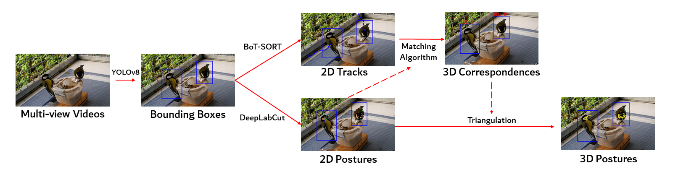

# 3D Tracking Pipeline



Here are all scripts and requirements for the 3D tracking pipeline in 3D-SOCS.

All scripts are set up to run for 1 sample trial (a set of synchronized videos captured by 3D-SOCS). You can freely adapt the code to run over your own data. Use this [link]() to download the sample dataset to run the code provided

**Here are the seperate parts for the 3D tracking pipeline:**
- Annotation and Network Training
- Calibration
- 3D Inference pipeline

**\*\*Make sure all code is ran in the current directory (`3DTracking/`)**


## Requirements
Firstly, please clone the [DeepLabCut-live!](https://github.com/DeepLabCut/DeepLabCut-live) repository under the [`Repositories/`](../Repositories/) directory to run the 3D tracking pipeline.

There are a series of required packages to run the pipeline. We recommend creating a [conda environment](https://www.anaconda.com/). 

You can create a new environment by running:
```
conda create -n 3DSOCS python=3.8
conda activate 3DSOCS
```

Installing required packages:
```
pip install pandas==1.3.5
pip install networkx==2.8.4
pip install colorcet==3.1.0
pip install natsort==8.4.0
pip install tqdm==4.65.0
pip install deeplabcut==2.3.3
pip install ultralytics==8.0.143
pip install tensorflow==2.4.0
pip install numpy==1.23.5

pip uninstall opencv-python
pip install opencv-contrib-python==4.5.5.64

```

## Network Training and Annotations
We provide the bounding box + keypoint estimation datasets used in 3D-SOCS and sample scripts to read the dataset, and do network training. Make sure the dataset is [downloaded](), and placed in the `Dataset/` folder in the repository.

### Annotation Reader
We provide a [data reader script](NetworkTraining/AnnotationReader.py) to read in the bounding box and keypoint annotations. The annotation reader can also be used for other datasets annotated using [label-studio](https://labelstud.io/), and exporting using the "JSON_MIN" option.


To get example annotations and visualization, run the following:

```
python NetworkTraining/AnnotationReader.py
```
### Training networks
We provide sample scripts for training the [YOLOv8](https://docs.ultralytics.com/) object detection model and [DeepLabCut](http://www.mackenziemathislab.org/deeplabcut#:~:text=DeepLabCut%E2%84%A2%20is%20an%20efficient,typically%2050%2D200%20frames) for 2D keypoint estimation.

#### YOLOv8:
Please modify the [NetworkTraining/Greti_YOLO.yaml](NetworkTraining/Greti_YOLO.yaml) config file to the absolute path to the dataset on your local computer.

Then, run the following which trains the model and put the weights and training statistics automatically under a `runs/` folder:
```
python NetworkTraining/YOLO_Train.py
```

### DeepLabCut:
Please modify the absolute path to the config file in L41 of [NetworkTraining/DLC_Train.py](NetworkTraining/DLC_Train.py) to the DeepLabCut config path. 

Then run the following to train the model, the weights are automatically saved and updated within the DLC folder.
```
python NetworkTraining/DLC_Train.py
```

## Calibration
We provide scripts to do multi-view intrinsic and extrinsic calibration. The script requires multi-view synchronized videos from 3D-SOCS as input. We only support calibration using [ChArUco checkerboards](https://docs.opencv.org/3.4/df/d4a/tutorial_charuco_detection.html). You can generate a custom checkerboard with a custom size and specification [online](https://calib.io/pages/camera-calibration-pattern-generator).

We provide a sample calibration sequence in the [sample dataset]() repository.

To run calibration on the sample calibration sequence, run:
```
python Calibration/RunCalibration.py
```

Final calibration parameters are stored under `data/` directory within the calibration video folder, with intrinsic and extrinsics parameters stored as pickle files.

If you are using your own sequences or ChArUco board, make sure to modify the paths and board specification from L20 - L36


## 3D Inference
Finally, we provide scripts to do 3D inference and all post-processing steps reported in 3D-SOCS. We provided a sample sequence taken from 3D-SOCS for demonstrating the scripts. Make sure the [sample dataset and weights]() are downloaded and placed in the appropriate folder.

To run the 3D tracking pipeline, run:
```
python Inference/Track3D.py
```
This runs YOLO and DLC, then saves all intermediate files under the `data/` folder within the video trial folder.

To run post processing, run the following:
```
python Inference/PostProcessing.py
```
All intermediate files for each post processing step is also saved within the `data/` folder as pickle files.

Finally, we provide a visualization script to visualize 3D tracking results and reprojected visual fields. To run visualization on the sample dataset, run:
```
python Inference/VisualizeData.py
```


## Contact
If you have any questions regarding the 3D tracking pipeline feel free to raise a github issue, or reach out to Alex Chan.

hoi-hang.chan[at]uni-konstanz.de