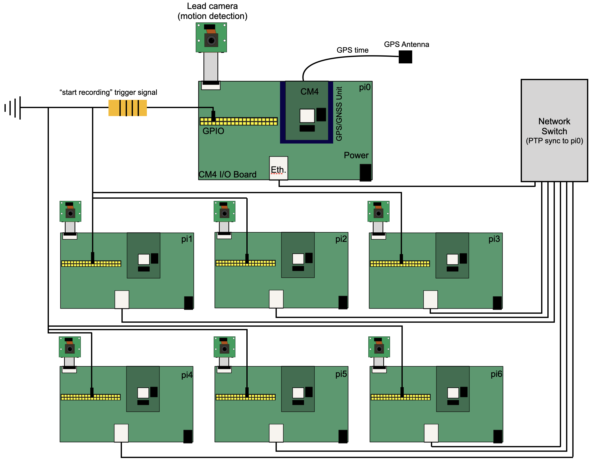

# Code for operating 3D-SOCS



## Contents
Directory  | Description
------------- | -------------
admin_shell_scripts | shell scripts to be run on laptop for admin tasks
ptp_configs | configuration files for lead and follower CM4 if using Timebeat for PTP synchronization
rpi_code | python and shell scripts for recording videos, operating stimulus display device.

### Contents of ```admin_scripts```
Filename  | Description
------------- | -------------
convert_videos_to_mp4.py | python script that converts .h264 videos to .mp4 and outputs time metadata for frame matching
pull_data.sh | copies video and metadata from all CM4 using rsync to local directory
ssh_all_pi.sh | opens ssh connections to all CM4

### Contents of ```ptp_configs```
Filename  | Description
------------- | -------------
lead_timebeat.yml | PTP config file for lead CM4
follower_timebeat.yml | PTP config file for follower CM4s

### Contents of ```rpi_code```
Filename  | Description
------------- | -------------
motion_detector.py | script that detects motion and sends 
record_videos.py | script that records frame synchronized videos on follower CM4.
rfid_perch.py | generalizable script to record data from RFID reader.
stimulus_device.py | script that controlled stimulus device used in manuscript.

## Further information

All python code was written for Python3. Packages required for python scripts:
- Picamera2
- libcamera
- cv2 
- RPi.GPIO
- numpy
- vidgear
- pandas

## Misc tips and tricks

### Shell scripts
* ```tmux``` is required to run these shell scripts, and can be installed using apt or similar (https://github.com/tmux/tmux/wiki).
* These scripts require you to input your own usernames, IP addresses, and local directory structures. IP addresses should be those that CM4 assign themselves automatically when no network connection is present, and can be checked with ```ifconfig```.

### PTP
* We highly recommend using timebeat's software for handling PTP. Make sure you obtain a license and move it to the correct directory ```/etc/timebeat/timebeat.lic```.

* PTP could fail if the system time at boot is out of bounds of the time-period defined by the license. To fix this, manually set the system time to within bounds using something like ```sudo date -s 'yyyy-mm-dd hh:mm:ss'``` and reboot.

* be sure to copy config .ymls to ```/etc/timebeat/timebeat.yml```

* To monitor the time synchronization remotely using Timebeat's software, be sure to input the IP of your connected machine into the .yml files in ```ptp_configs``` and uncomment the line:

```shell
# ---------------------------- Elasticsearch Output ----------------------------
output.elasticsearch:
  #enabled: false
  # Array of hosts to connect to.
  # hosts: ['YourIPGoesHere'] # insert ip address of your elastic server
```

* NTP (and other time sync programs) interfere with PTP. Make sure they're disabled using:

```shell
timedatectl | grep NTP
sudo timedatectl set-ntp false
```

* Use minicom to monitor the satellite connection, instructions here: https://support.timebeat.app/hc/en-gb/articles/13208081167378-Timebeat-Timecard-Mini-Troubleshooting-Guide

